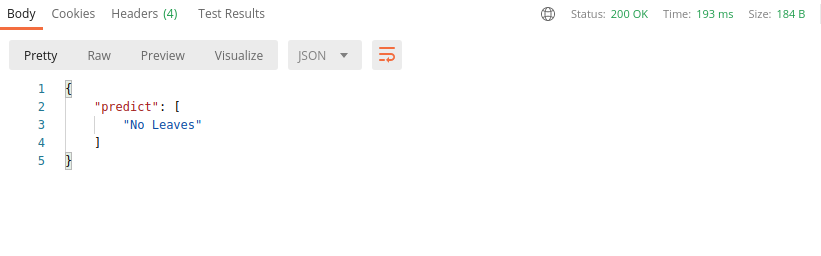

# Leaves-Recognition-Api
A flask webapp to detect Leaves in a List of Images.The web app can take single or batch input in base64 format of image and predict the presence of leaves and distinguish of object. 

## Description: 
The Model is build and trained using inception model. The user have option to upload a image as a single or batch input in base64 format. API can be tested using PostMan. 
The api checks following conditions - 
1. If the uploaded List containes base64 format images or not(empty list error - No image selected).
2. If the uploaded List containes empty string inside.(empty string error - 0 image length).

The image is then converted into .jpg format and stored into a folder and each image is 
then scanned for prediction using <b>predict_binary(image_name)</b>->(created function in app.py) and necessary adjustments to the image are done , this process is repeated till all images have been scanned and all predictions are combined to make a List of output and stored in a list <b>predict_list</b>(var defined inside app.py)
The input and output are given in POST method at url:http://0.0.0.0:5000/

## Sample Input 
Body: {
"image_list":[“List of images in base64 format”]
}

## Sample Ouput

## single image

## multiple image 

## Back_End: 
Python, Flask  

## Database 
sqlite3

## Libraries_used: 

### Flask libraries
from flask import Flask, request, jsonify, make_response
# lib for base64 conversion
import base64
# lib for interacting with the operating system
import os
# API Jason files
from flask_restful import Resource, Api
import json
# tensorflow libraries
from tensorflow import keras
import tensorflow as tf
import numpy as np
from tensorflow.keras.preprocessing import image
from tensorflow.keras.applications.inception_v3 import preprocess_input
from tensorflow.keras.preprocessing.image import img_to_array
from tensorflow.keras.models import load_model
   

## RUN: 

1. Clone the repo   
2. Create environment  
3. pip install -r requirements.txt  
4. python app.py  

## Demo:  

